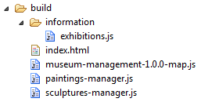
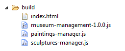

title: Packaging
page: packaging
---
# Packaging with noderJS

This page will detail how to package your application when you are using noderJS.

The tool that allows you to do that is [`atpackager`](http://atpackager.ariatemplates.com/). noderJS provides the necessary builders and visitors that you can use with atpackager during the build of your application.

The main steps will be introduced by means of an example. Suppose you have a project with the following file structure:


The `index.html` file looks like this:

```html
<!DOCTYPE html>
<html>
    <head>
        <meta charset="utf-8">
        <title>My museum</title>
    </head>
    <body>
        <script type="text/javascript" src="http://noder-js.ariatemplates.com/dist/v%NODERJSVERSION%/noder.min.js">{
            main : "information/exhibitions",
            onstart : function (exhib) {
                console.log("Current exhibitions", exhib.current());
            }
        }</script>
        <script type="application/x-noder">
            var paintings = require('paintings/catalogue').getAll();
            console.log("paintings", paintings);
        </script>
    </body>
</html>
```
We are basically loading noderJS from an external source, instructing it to load the main module `"information/exhibitions"`. In the script of type `"noder"`, the `require` method leads to the fetch and execution of module `"paintings/catalogue"`. When targeting this page, the following files are downloaded from the server:
- `http://noder-js.ariatemplates.com/dist/v%NODERJSVERSION%/noder.min.js`
- `information/exhibitions.js`
- `paintings/catalogue.js`
- `paintings/painting.js`
- `paintings/image.js`

In fact, module `"paintings/catalogue"` requires `"paintings/painting"`, which, in turn, requires `"paintings/image"`.

Of course, this is not acceptable in a production environment. We need some packaging!!!

## Creating packages - the `NoderPackage` builder

We will now use [grunt](http://gruntjs.com/) and [`atpackager`](http://atpackager.ariatemplates.com/) in order to group our modules in several packages.

Let's first add a `package.json` file at the root of our project. This will allow us to use [`npm`](https://www.npmjs.org/) to fetch the dependencies we need.

```json
{
    "name" : "museum-management",
    "version" : "1.0.0",
    "devDependencies" : {
        "atpackager" : "0.2.4",
        "noder-js" : "%NODERJSVERSION%"
    }
}
```

We can now configure our grunt build. The `gruntfile.js` that we put at the root of our project looks like this:

```javascript
module.exports = function (grunt) {

    grunt.initConfig({
        pkg : require("./package.json"),
        atpackager : {
            packaging : {
                options : {
                    sourceFiles : ["**/*"],
                    sourceDirectories : ["src"],
                    outputDirectory : "build",
                    visitors : ["JSMinify", {
                                type : "NoderMap",
                                cfg : {
                                    toFile : "<%= pkg.name %>-<%= pkg.version %>-map.js"
                                }
                            }, {
                                type : "CopyUnpackaged",
                                cfg : {
                                    files : ["**/*"],
                                    builder : "Concat"
                                }
                            }],
                    packages : [{
                                name : "paintings-manager.js",
                                builder : "NoderPackage",
                                files : ["paintings/**/*.js"]
                            }, {
                                name : "sculptures-manager.js",
                                builder : "NoderPackage",
                                files : ["sculptures/**/*.js"]
                            }]
                }
            }
        }
    });

    grunt.loadNpmTasks("atpackager");
    require("atpackager").loadNpmPlugin("noder-js");

    grunt.registerTask("default", ["atpackager:packaging"]);
};
```

Apart from the basic configuration for [`atpackager`](http://atpackager.ariatemplates.com/), in which we specify the source files, the source directory, and the output directory, there is
- a list of packages
- and a list of visitors.

You can see that we define two entries in the list of packages. The `builder` property of both of them is set to **`NoderPackage`**. This is the first builder that comes with noderJS: it just groups a set of module definitions. Indeed, if you inspect a bundle, you will realize that it contains a sequence of call to the `define` method.

How does noderJS know that, for example, module `"paintings/catalogue"` is in package `"paintings-manager.js"`? We need to update the packagesMap in its configuration. In order to do that, we can use the `NoderMap` visitor (that is documented more properly later). Indeed, you can see how we added it in the list of visitors of atpackager with the `toFile` configuration property set to "museum-management-1.0.0-map.js". This file will contain the code that is needed to perform the update, so it has to be included as source of a `<script>` tag right after loading noderJS bootstrap.
This is what the `index.html` becomes.

```html
<html>
    <head>
        <meta charset="utf-8">
        <title>My museum</title>
    </head>
    <body>
        <script type="text/javascript" src="http://noder-js.ariatemplates.com/dist/v%NODERJSVERSION%/noder.min.js">{
            main : "information/exhibitions",
            onstart : function (exhib) {
                console.log("Current exhibitions", exhib.current());
            }
        }</script>
        <script type="text/javascript" src="museum-management-1.0.0-map.js"></script>

        <script type="application/x-noder">
            var paintings = require('paintings/catalogue').getAll();
            console.log("paintings", paintings);
        </script>
    </body>
</html>
```


We also used the `JSMinify` visitor to minify both noderJS and our sources, as well as the `CopyUnpackaged` visitor to copy all unpackaged resources to the `build` directory.

We can now run
```
npm install && grunt
```

The `build` folder of our project now looks like this



If we target the `index.html` file of the `build` folder, the following resources are downloaded from the server:
- `http://noder-js.ariatemplates.com/dist/v%NODERJSVERSION%/noder.min.js`
- `museum-management-1.0.0-map.js`
- `information/exhibitions.js`
- `paintings-manager.js`


### Advanced configuration properties
There is only one configuration property that is specific to the `NoderPackage` builder. You are not likely to need it in your build.
* `moduleFunction`: code that is used to wrap the definition of each module.

This builder inherits from the `JSConcat` default builder of atpackager. More configuration properties (like `header`, `footer` and so on) are available and documented [here](http://atpackager.ariatemplates.com/).
In particular, an interesting inherited property is `outputFileWrapper`. It allows to build packages that can directly be included as sources for script tags. Indeed,
```
outputFileWrapper : "(function(define){$CONTENT$;})(noder.define);"
```
will wrap all modules definition in a function that is directly called providing as argument the `define` method defined on the `noder` global variable.

We encourage you to inspect the result of the build in order to gain more insight on the process.

**Takeaway:** _it is possible to create different packages by using the **`NoderPackage`** builder for atpackager. It has to be used along with the `NoderMap` visitor in order to update the packages map that noderJS will use to retrieve resources._


## Creating a bootstrap script - the `NoderBootstrapPackage` builder

In the previous example, we are still fetching noderJS bootstrap from an external url. It is also possible to create our own bootstrap file for noderJS which
- contains all of our source modules and
- embeds a noderJS distribution.


Let's now configure a grunt build so that atpackager can be correctly run to generate a bootstrap file. The `gruntfile.js` now looks like this:

```javascript
module.exports = function (grunt) {

    grunt.initConfig({
        pkg : require("./package.json"),
        atpackager : {
            packaging : {
                options : {
                    sourceFiles : ["**/*"],
                    sourceDirectories : ["src"],
                    outputDirectory : "build",
                    visitors : ["JSMinify", {
                                type : "CopyUnpackaged",
                                cfg : {
                                    files : ["**/*"],
                                    builder : "Concat"
                                }
                            }],
                    packages : [{
                                name : "<%= pkg.name %>-<%= pkg.version %>.js",
                                builder : {
                                    type : "NoderBootstrapPackage",
                                    cfg : {
                                        noderConfigOptions : {
                                            main : "information/exhibitions"
                                        }
                                    }
                                },
                                files : ["**/*.js"]
                            }]
                }
            }
        }
    });

    grunt.loadNpmTasks("atpackager");
    require("atpackager").loadNpmPlugin("noder-js");

    grunt.registerTask("default", ["atpackager:packaging"]);
};
```

You can notice that in `atpackager.packaging.options.packages` we only have one bundle that is built using **`NoderBootstrapPackage`** builder and has to include all the `.js` files in the `src` directory.

This builder can receive different configuration properties. The most relevant one for us is the `noderConfigOptions` which allows us to configure the way we want noderJS to run. Its different properties are detailed [here](configuration.html). In this example we only declared the main module to load (we won't need to declare it in the `index.html` page any longer).

Thus the `<script>` tag including noderJS as an external resource in the html page shown above now becomes

```html
    <script type="text/javascript" src="museum-management-1.0.0.js">{
    	onstart : function (exhib) {
            console.log("Current exhibitions", exhib.current());
        }
    }</script>
```

We also used the `JSMinify` visitor to minify both noderJS and our sources, as well as the `CopyUnpackaged` visitor to copy all unpackaged resources (in this case only the `index.html` file) to the `build` directory.

When we target the `build` directory with the browser, the only resource that is downloaded now is the newly built `museum-management-1.0.0.js` file.

### Configuration properties
#### Basic
This is the most useful configuration property for the `NoderBootstrapPackage` builder
* `noderConfigOptions`: as explained above, it corresponds to the noderJS configuration. Many of its properties can be automatically added by using visitors. Later in this article you will discover the available ones.

#### Advanced
The following properties are advanced settings. You are not likely to need them in your build for most usecases.
* `noderConfig`: the label of this specific noderJS configuration. This property has to be used in case you are creating multiple bootstrap bundles. it will allow to identify this bundle when using visitors.
* `noderModules`: a list of modules that can replace noderJS default ones. For example, if you include a module called `loader`, it will override the default `loader` of noderJS.
* `noderMainModule`: internal noderJS module that has to be executed. It defaults to `"main"`.
* `noderEnvironment`: either `"browser"` or `"node"` (default: `"browser"`).
* `noderConfigErrorOptions`: the errorContext configuration object.
* `noderPackageWrapper`: the code that will be used to wrap all the definitions of the modules included in the bootstrap. It defaults to `"(function(define) {\n $CONTENT$\n })"`, where `"$CONTENT$"` is the sequence of calls to the `define` method that declares your modules.
* `noderPackageConfigProperty`: the configuration property into which the bootstrap package description will be injected. It defaults to `"mainContext.packaging.bootstrap"`.
* `moduleFunction`: code that is used to wrap the definition of each module.

This builder inherits from the `JSConcat` default builder of atpackager. More configuration properties (like `header`, `footer` and so on) are available and documented [here](http://atpackager.ariatemplates.com/).

**Takeaway:** _When packaging your noderJS based application, you can use **`NoderBootstrapPackage`** builder for atpackager to generate a bootstrap file. This file will contain noderJS and all the resources that you might want to include in it._


### Creating several packages along with the bootstrap

We don't necessarily want to include all of our sources in the bootstrap file. For example, in our application, we might want to keep module `"information/exhibitions"` inside the bootstrap file (it's the main module), but we want to keep all modules in `paintings` and `sculptures` folders in separate packages. This is the grunt file that allows us to achieve this result:
```javascript
module.exports = function (grunt) {

    grunt.initConfig({
        pkg : require("./package.json"),
        atpackager : {
            packaging : {
                options : {
                    sourceFiles : ["**/*"],
                    sourceDirectories : ["src"],
                    outputDirectory : "build",
                    visitors : ["JSMinify", "NoderMap", {
                                type : "CopyUnpackaged",
                                cfg : {
                                    files : ["**/*"],
                                    builder : "Concat"
                                }
                            }],
                    packages : [{
                                name : "<%= pkg.name %>-<%= pkg.version %>.js",
                                builder : {
                                    type : "NoderBootstrapPackage",
                                    cfg : {
                                        noderConfigOptions : {
                                            main : "information/exhibitions"
                                        }
                                    }
                                },
                                files : ["information/*.js"]
                            }, {
                                name : "paintings-manager.js",
                                builder : "NoderPackage",
                                files : ["paintings/**/*.js"]
                            }, {
                                name : "sculptures-manager.js",
                                builder : "NoderPackage",
                                files : ["sculptures/**/*.js"]
                            }]
                }
            }
        }
    });

    grunt.loadNpmTasks("atpackager");
    require("atpackager").loadNpmPlugin("noder-js");

    grunt.registerTask("default", ["atpackager:packaging"]);
};
```
You can notice that two more entries are present in the list of packages. The `builder` property of both of them is set to **`NoderPackage`**, that was introduced earlier in this article.
We have already stressed that when you package your modules you need to use the `NoderMap` visitor in order to notify noderJS about the map of packages. When you use the `NoderBootstrapPackage` builder to create a new bootstrap file that contains noderJS, you don't need to provide a file path (`toFile` property) for the map update, as the `NoderMap` visitor will automatically embed the required information in the boostrap.


The `build` folder of our project now looks like this



If we target the `index.html` file, only two resources are downloaded from the server:
- `museum-management-1.0.0.js`
- `paintings-manager.js`.

**Takeaway:** _it is possible to create a bootstrap package using **`NoderBootstrapPackage`** builder and different other packages by using the **`NoderPackage`** builder for atpackager. The `NoderMap` visitor will take care of automatically updating the packages map in the bootstrap._


## Visitors

As already hinted earlier, noderJS comes with a set of visitors for atpackager. We will describe them in this section.

### NoderMap

We have already encountered this visitor when talking about the **`NoderPackage`** builder for packages. If present in the list of visitors, it will
- either create a file that will update noderJS packages map (if the `toFile` property is set). This file will have to be included as src of a `<script>` tag,
- or interact with the creation of the bootstrap file in order to decorate the `packaging.packagesMap` property of noderJS configuration with the correct information about the physical files containing packaged resources. This option only makes sense if you are using the **`NoderBootstrapPackage`** builder to create your own bootstrap file.

#### Configuration properties
**Basic**
* `toFile`: when a file path is specified, the visitor will create a file in the output directory which contains the code needed to update the packages map (it relies on method `noder.updatePackagesMap` described [here](api.html)). The packagesMap configuration will not be injected inside the bootstrap file created by the above-mentioned `NoderBootstrapPackage` builder, so in order to allow noder to correctly find modules in packages, this output file will have to be explicitly injected inside the HTML page as source of a `<script>` tag.

**Advanced**

These configuration properties are quite advanced and rarely needed.
* `sourceFiles`: the files to take into account in the map (default: `['**/*']`).
* `outputFiles`: output files to take into account in the map (default: `['**/*']`).
* `starCompress`: the list of files for which it is allowed to put a single entry (`"*"`) in the map in case they all come from the same directory and they all are in the same package (default: `['**/*']`).
* `starStarCompress`:  the list of files for which it is allowed to put a single entry (`"**"`) in the map in case they all come from the same directory or one of its nested directories and they all are in the same package (default: `['**/*']`).
* `noderConfig`: the identifier of the noderJS configuration for which the map should be applied. This configuration should be declared also in one of the bootstrap configurations.
* `noderContext`: the context for which this map should apply (either `"mainContext"` or `"errorContext"`).
* `varName`: global variable used for noder global object. This property can be used in conjunction with `toFile` in order to override the default global object used to call the `updatePackagesMap` method. It defaults to `"noder"`.
### NoderDependencies

This visitor allows to automatically add to a package all the dependencies of the modules that are explicitly added to it. This can be useful if you want to specify only the main file of a bundle without worrying about all the possible dependencies that it might have.

In our example, we can configure package `paintings-manager.js` to explicitly include only module `"paintings/catalogue"`, which is providing us with the main features that we intend to use. The other files in the same folders (from which it depends) will be automatically included.
Let's take a look at the grunt file that allows to achieve this result.

```javascript
module.exports = function (grunt) {

    grunt.initConfig({
        pkg : require("./package.json"),
        atpackager : {
            packaging : {
                options : {
                    sourceFiles : ["**/*"],
                    sourceDirectories : ["src"],
                    outputDirectory : "build",
                    visitors : ["JSMinify", "NoderMap", {
                                type : "CheckDependencies",
                                cfg : {
                                    noCircularDependencies : false,
                                    checkPackagesOrder : false
                                }
                            }, {
                                type : "NoderDependencies",
                                cfg : {
                                    externalDependencies : ["noder-js/**"]
                                }
                            }, {
                                type : "CopyUnpackaged",
                                cfg : {
                                    files : ["**/*"],
                                    builder : "Concat"
                                }
                            }],
                    packages : [{
                                name : "<%= pkg.name %>-<%= pkg.version %>.js",
                                builder : {
                                    type : "NoderBootstrapPackage",
                                    cfg : {
                                        noderConfigOptions : {
                                            main : "information/exhibitions"
                                        }
                                    }
                                },
                                files : ["information/*.js"]
                            }, {
                                name : "paintings-manager.js",
                                builder : "NoderPackage",
                                files : ["paintings/catalogue.js"]
                            }, {
                                name : "sculptures-manager.js",
                                builder : "NoderPackage",
                                files : ["sculptures/**/*.js"]
                            }]
                }
            }
        }
    });

    grunt.loadNpmTasks("atpackager");
    require("atpackager").loadNpmPlugin("noder-js");

    grunt.registerTask("default", ["atpackager:packaging"]);
};
```

**Remark**
This visitor **must** be used in conjunction with the `CheckDependencies` standard visitor provided by atpackager (it is often a good idea to configure it so that circular dependencies or the wrong package order do not give rise to build errors).

#### Configuration properties
**Basic**
* `files`: the list of files to process (default: `['**/*.js']`).
* `mustExist`: whether to raise an error when a detected dependency cannot be found (default: `true`).
* `externalDependencies`: array of external dependencies that must be ignored by the visitor.

**Advanced**
* `noderConfig`: the identifier of the noderJS configuration that should be used to resolve the dependencies. This configuration should be declared also in one of the bootstrap configurations.
* `noderContext`: the context that will be used to resolve dependencies (either `"mainContext"` or `"errorContext"`).


### NoderPlugins

This visitor needs to be added in order to have a verbose error logging for noderJS.

The default error logging capabilities are not included in the distribution of noderJS, nor in the list of modules that contribute to the bootstrap file of your own packaging. They are considered as an additional plugin that you can include.

Whenever an error occurs, noderJS will try to load module `"noderError/error"`. This visitor deploys this module and its dependencies in the output folder of your build, so that it becomes automatically available.

#### Advanced configuration properties
* `targetFiles`: the files that we want to deploy to the `noderError` folder (default: `['**/*']`).
* `customPackage`: if `false` (default value) they will be deployed as they are. If you are including them into one of your own packages, then set this to `true`.
* `builder`: if `customPackage` is false, you can specify the builder that you want to use to process these files.
* `targetBaseLogicalPath`: base path onto which they will be copied (default: `""`).


### NoderExportVars

This visitor automatically adds to the `exports` property of your module all variables that are globally defined in its scope. For example the following module
```javascript
var myDep = require("../anotherModule");

var myMethod = function () {
    var localToTheMethod = "just a string";
    //...
};
```

would be automatically converted into
```javascript
var myDep = require("../anotherModule");

var myMethod = function () {
    var localToTheMethod = "just a string";
    //...
};

exports.myDep = myDep;
exports.myMethod = myMethod;
```

#### Configuration properties

The only possible configuration property is the list of files to process (which defaults to `["**/*.js"]`).
```json
{
    type : "NoderExportVars",
    cfg : {
        files : ["paintings/*.js", "!paintings/image.js"]
    }
}
```

### NoderRequiresGenerator

This visitor allows to create a file in the output directory of your project in which some modules are `require`d.
#### Configuration propeties
**Basic**
* `requires`: list of required modules
* `targetLogicalPath`: logical path for the target file
For example
```json
{
    type : "NoderRequiresGenerator",
    cfg : {
        requires : ["my/other/dep", "b"],
        targetLogicalPath : "deps.js"
    }
}
```
yields as result file `build/deps.js`:
```javascript
require("my/other/dep");
require("b");
```

**Advanced**
* `requireFunction`: a string specifying what is the require function to use. it defaults to `"require"`.
* `wrapper`: a string that allows to specify how to wrap the generated code. Inside this string you can use the placeholder `"$CONTENT$"` to refer to the generated sequence of `require`s. It defaults to `"$CONTENT$"`.


### NoderResolverMap

This visitor decorates the `resolver` configuration property of noderJS with a list of directories. This allows to require a folder as a dependency in your code (without an explicit declaration it would be impossible, on the client-side, to know whether a certain path corresponds to a folder or a module).

#### Configuration properties
**Basic**

Here is its basic configuration.
```json
{
    type : "NoderResolverMap",
    cfg : {
        files : ["paintings/*", "sculptures/*"]
    }
}
```

The visitor will understand that `paintings` and `sculptures` are directories, and declare them.

**Advanced**
* `noderConfig`: the configuration of noder for which this resolver should be applied. This is useful if you are creating different bootstrap packages (check the `NoderBootstrapPackage` configuration above).
* `noderContext`: the context of noder to use for the resolver declaration (either `"mainContext"` or `"errorContext"`). It defaults to `"mainContext"`.